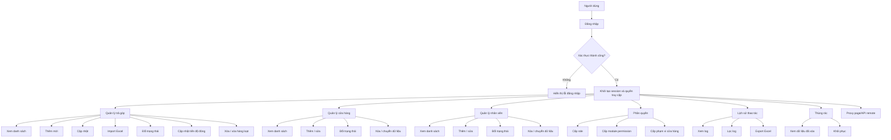
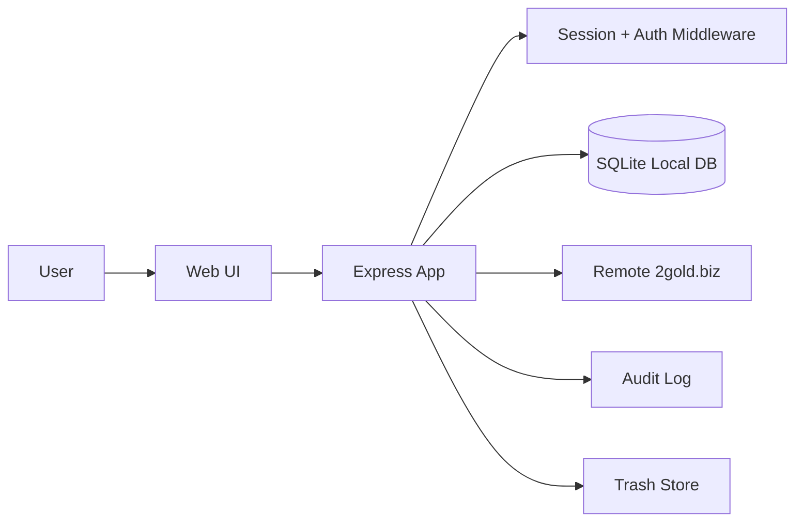
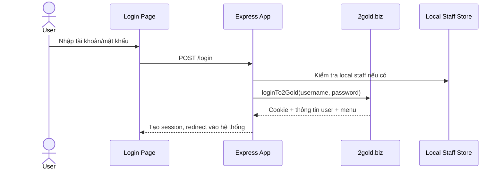
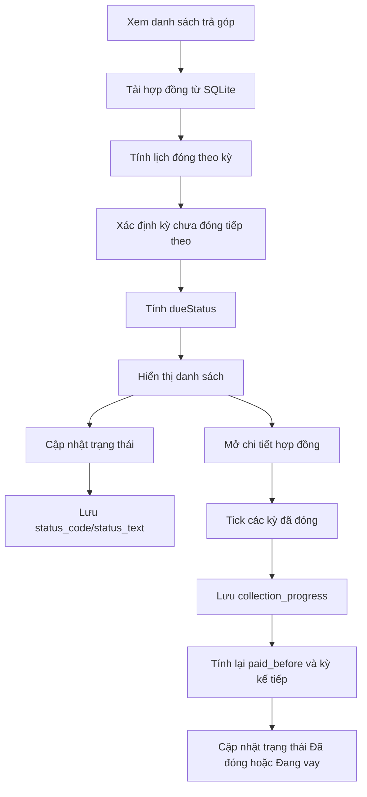
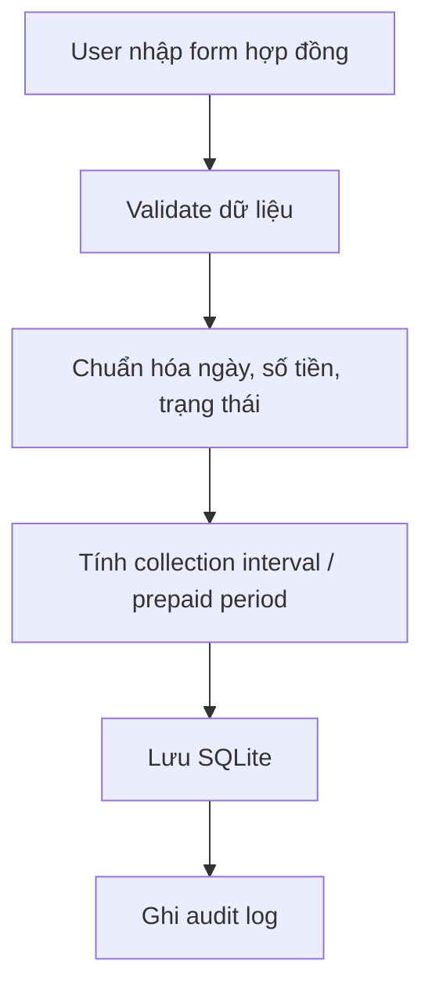
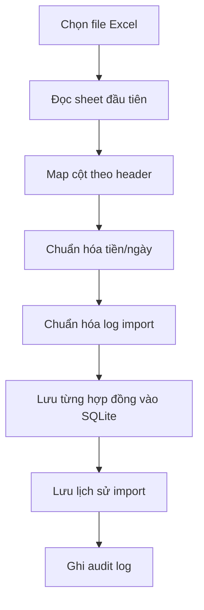
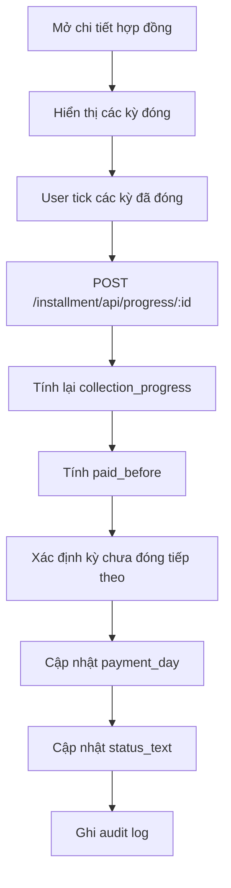
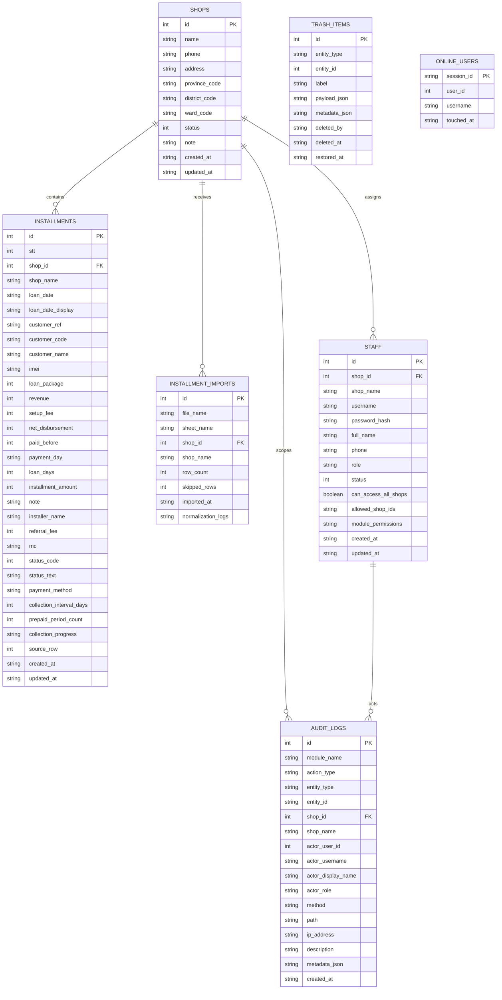

# Beat5 Use Case Và Luồng Nghiệp Vụ

## 1. Mục tiêu hệ thống

Hệ thống `Beat5` là ứng dụng nội bộ quản lý:

- Hợp đồng trả góp
- Cửa hàng
- Nhân viên
- Phân quyền nhân viên
- Lịch sử thao tác
- Thùng rác khôi phục dữ liệu

Ngoài dữ liệu nội bộ, hệ thống còn:

- Đăng nhập qua `2gold.biz`
- Proxy một số API/page từ hệ thống ngoài
- Lưu session/cookie remote để người dùng thao tác liên tục

## 2. Tác nhân chính

- `Admin`
  - Toàn quyền hệ thống
  - Truy cập mọi cửa hàng
  - Phân quyền nhân viên
  - Quản lý thùng rác
- `Nhân viên`
  - Đăng nhập hệ thống
  - Truy cập theo module được cấp
  - Truy cập theo phạm vi cửa hàng được cấp
- `Hệ thống remote 2gold.biz`
  - Xác thực đăng nhập
  - Cung cấp một phần page/API nguồn

## 3. Use case tổng quan

## 4. Luồng tổng quan hệ thống

Ý nghĩa:

- `Web UI`: giao diện người dùng thao tác
- `Express App`: xử lý route, validate, phân quyền
- `Session + Auth`: xác thực và giới hạn truy cập
- `SQLite Local DB`: lưu dữ liệu nội bộ
- `Remote 2gold.biz`: nguồn đăng nhập và một phần dữ liệu/trang remote
- `Audit Log`: lưu lịch sử thao tác
- `Trash Store`: lưu snapshot để khôi phục sau xóa

## 5. Luồng đăng nhập và phân quyền

### 5.1 Đăng nhập

### 5.2 Phân quyền

Logic phân quyền hiện có:

- Nếu chưa đăng nhập:
  - bị chuyển về `/login`
- Nếu là `admin`:
  - có toàn quyền module
  - có toàn quyền cửa hàng
- Nếu là nhân viên:
  - chỉ vào được module đã được cấp
  - chỉ xem/sửa dữ liệu của cửa hàng được cấp

Ba lớp kiểm soát:

- `requireAuth`
- `requireModulePermission(module)`
- `requireAdmin`

## 6. Use case theo module

### 6.1 Trả góp

Mục đích:

- Quản lý hợp đồng trả góp nội bộ
- Theo dõi tiến độ đóng tiền theo kỳ
- Cảnh báo sắp đến hạn, đến hạn hôm nay, quá hạn

Use case chính:

1. Xem danh sách hợp đồng
2. Lọc theo cửa hàng, trạng thái, ngày, số ngày vay
3. Thêm mới hợp đồng
4. Cập nhật hợp đồng
5. Import Excel
6. Đổi trạng thái hợp đồng
7. Cập nhật tiến độ đóng tiền theo kỳ
8. Xóa mềm vào thùng rác
9. Xóa hàng loạt

Luồng nghiệp vụ:

Logic quan trọng đang có:

- Hợp đồng được chia thành nhiều kỳ dựa trên:
  - `loanDate`
  - `loanDays`
  - `collectionIntervalDays`
  - `revenue`
- `collection_progress` lưu các kỳ đã đóng
- Kỳ chưa đóng tiếp theo quyết định:
  - ngày phải đóng tiếp theo
  - `dueStatus`
  - cảnh báo `sắp đến hạn`, `đến hạn hôm nay`, `quá hạn`
- Nếu tất cả kỳ đã đóng:
  - trạng thái được cập nhật sang `Đã đóng`

Quy tắc cảnh báo hiện tại:

- `due_today`: kỳ chưa đóng tiếp theo đến hạn hôm nay
- `due_soon`: kỳ chưa đóng tiếp theo trong vòng 3 ngày tới
- `overdue`: kỳ chưa đóng tiếp theo đã qua hạn

### 6.2 Cửa hàng

Use case:

1. Xem danh sách cửa hàng
2. Thêm mới / cập nhật cửa hàng
3. Đổi trạng thái hoạt động
4. Xóa cửa hàng
5. Xóa nhiều cửa hàng
6. Chuyển dữ liệu sang cửa hàng khác trước khi xóa

Logic quan trọng:

- Xóa cửa hàng có thể yêu cầu chuyển dữ liệu trả góp liên quan
- Một số thao tác chỉ `admin` mới làm được

### 6.3 Nhân viên

Use case:

1. Xem danh sách nhân viên
2. Thêm mới / cập nhật nhân viên
3. Đổi trạng thái làm việc
4. Xóa nhân viên
5. Xóa hàng loạt
6. Chuyển dữ liệu hợp đồng sang nhân viên khác trước khi xóa

Logic quan trọng:

- Nhân viên bị khóa thì không được đăng nhập
- Có kiểm tra phạm vi cửa hàng trước khi thao tác

### 6.4 Phân quyền

Use case:

1. Chọn nhân viên
2. Gán role
3. Gán quyền module
4. Gán quyền truy cập tất cả cửa hàng hoặc danh sách cửa hàng cụ thể

Chỉ `admin` được thao tác.

### 6.5 Lịch sử thao tác

Use case:

1. Xem log thao tác
2. Lọc theo:
  - module
  - action
  - user
  - shop
  - thời gian
3. Export Excel

Nguồn log:

- login/logout
- context switch cửa hàng
- create/update/delete/bulk action
- import
- restore
- export
- access page

### 6.6 Thùng rác

Use case:

1. Xem danh sách dữ liệu đã xóa
2. Khôi phục cửa hàng
3. Khôi phục nhân viên
4. Khôi phục hợp đồng

Logic:

- Trước khi xóa, hệ thống lưu snapshot vào trash
- Khi restore, hệ thống kiểm tra ràng buộc dữ liệu gốc

## 7. Sơ đồ luồng chi tiết trả góp

### 7.1 Thêm / sửa hợp đồng

### 7.2 Import Excel

### 7.3 Cập nhật tiến độ đóng tiền

## 8. Route nghiệp vụ chính

### 8.1 Auth

- `GET /login`
- `POST /login`
- `POST /logout`
- `POST /context/shop`

### 8.2 Trả góp

- `GET /Installment/Index/`
- `GET /Installment/Create`
- `GET /Installment/Edit/:id`
- `POST /Installment/Create`
- `POST /Installment/Edit/:id`
- `GET /installment/api/list`
- `POST /installment/api/import`
- `DELETE /installment/api/:id`
- `POST /installment/api/bulk-delete`
- `POST /installment/api/bulk-status`
- `POST /installment/api/progress/:id`

### 8.3 Cửa hàng

- `GET /Shop/Index/`
- `GET /Shop/Create`
- `GET /Shop/Edit/:id`
- `POST /Shop/Create`
- `GET /shop/api/list`
- `GET /shop/api/localities/wards`
- `GET /shop/api/transfer-options`
- `DELETE /shop/api/:id`
- `POST /shop/api/bulk-delete`
- `POST /shop/api/bulk-status`

### 8.4 Nhân viên

- `GET /Staff/Index/`
- `GET /Staff/Create`
- `POST /Staff/Create`
- `GET /staff/api/list`
- `GET /staff/api/transfer-options`
- `DELETE /staff/api/:id`
- `POST /staff/api/bulk-delete`
- `POST /staff/api/bulk-status`

### 8.5 Phân quyền

- `GET /Staff/PermissionStaff/`
- `POST /Staff/PermissionStaff/:id`

### 8.6 Lịch sử và thùng rác

- `GET /History/`
- `GET /History/Export`
- `GET /Trash/Index/`
- `GET /trash/api/list`
- `POST /trash/api/restore/:id`

## 9. Quy tắc dữ liệu quan trọng

### 9.1 Trả góp

- `status_code/status_text`: trạng thái nghiệp vụ của hợp đồng
- `collection_interval_days`: số ngày mỗi kỳ
- `collection_progress`: danh sách kỳ đã đóng
- `paid_before`: tổng số tiền đã đóng tương ứng các kỳ
- `payment_day`: ngày phải đóng của kỳ chưa đóng tiếp theo

### 9.2 Shop scope

- Admin hoặc user có `canAccessAllShops = true`:
  - xem toàn bộ
- User thường:
  - chỉ xem trong `shopId` hiện tại hoặc `allowedShopIds`

## 10. Điểm mạnh của logic hiện tại

- Phân quyền tách rõ theo:
  - đăng nhập
  - module
  - admin
  - phạm vi cửa hàng
- Có audit log đầy đủ
- Có cơ chế thùng rác để khôi phục
- Có import Excel và chuẩn hóa dữ liệu
- Có tính lịch đóng tiền theo kỳ
- Có cảnh báo đến hạn/quá hạn theo kỳ chưa đóng tiếp theo

## 11. Điểm cần lưu ý vận hành

- Một số text trong code còn lỗi encoding cũ
- Hệ thống vừa dùng dữ liệu local, vừa dùng remote 2gold.biz
- Khi đổi logic trả góp, cần kiểm tra đồng thời:
  - list API
  - dashboard
  - detail modal
  - bulk status
  - progress update

## 12. Đề xuất tài liệu tiếp theo

Nếu cần, có thể tách tiếp thành 3 file riêng:

- `docs/use-case-chi-tiet.md`
- `docs/so-do-luong-nghiep-vu.md`
- `docs/erd-va-data-dictionary.md`

## 13. ERD Mermaid

### 13.1 Ghi chú quan hệ

- `SHOPS -> INSTALLMENTS`: một cửa hàng có nhiều hợp đồng trả góp.
- `SHOPS -> STAFF`: một cửa hàng có nhiều nhân viên.
- `SHOPS -> INSTALLMENT_IMPORTS`: mỗi lần import Excel gắn với một cửa hàng đích.
- `SHOPS -> AUDIT_LOGS`: log có thể gắn theo phạm vi cửa hàng.
- `STAFF -> AUDIT_LOGS`: nhân viên là tác nhân thực hiện thao tác.

### 13.2 Ghi chú thiết kế dữ liệu

- `allowed_shop_ids`, `module_permissions`, `collection_progress`, `normalization_logs`, `metadata_json`, `payload_json` hiện là dữ liệu dạng chuỗi JSON.
- `INSTALLMENTS.shop_name`, `STAFF.shop_name`, `INSTALLMENT_IMPORTS.shop_name` là dữ liệu dư thừa có chủ đích để hiển thị nhanh và lưu snapshot theo thời điểm.
- `TRASH_ITEMS` không ràng buộc FK cứng vì mục tiêu là giữ snapshot kể cả khi dữ liệu gốc đã bị xóa.
- `ONLINE_USERS` là dữ liệu runtime phục vụ thống kê người dùng online.
